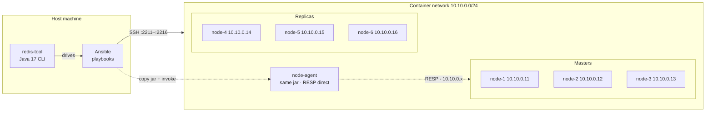
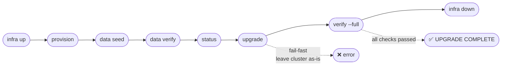
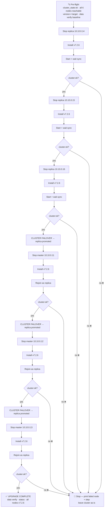

# redis-tool
 
> A zero-downtime Redis Cluster lifecycle tool — provision, seed, upgrade, verify, and scale a 6-node Redis Cluster with a single CLI backed by Ansible.
 
```
./redis-tool provision --version 7.0.15 --masters 3 --replicas-per-master 1
./redis-tool upgrade   --target-version 7.2.6  --strategy rolling
```
 
**No manual SSH. No manual redis-cli. Everything is driven through the CLI.**
 
---
## Under the hood
 
`redis-tool` manages a 6-node Redis Cluster (3 masters + 3 replicas) running inside containers that simulate real SSH-accessible servers.
 
- Written in **Java 17** — one self-contained executable (bash launcher + embedded jar).
- Drives **Ansible** playbooks for all remote work — no Galaxy collections, everything hand-written.
- Works on **Docker** or **Podman**, **macOS**, **Linux**, and **WSL2**.
- The same executable copies itself onto a node to do data operations (seed/verify) from inside the container network — no cross-compiling needed.
 
 ---
 
### Architecture
 


### Full workflow
 

 
---
 
## Features at a glance
 
| Command | What it does |
|---|---|
| `infra up / down / status` | Spin the 6 containers up or down |
| `provision --version V` | Build Redis from source, configure cluster mode, form the cluster |
| `data seed --keys N` | Insert N deterministic keys (`value = sha256(key)`) |
| `data verify` | Read all keys back, recompute, print **PASS** or **FAIL** |
| `status` | Cluster topology — roles, versions, slot ranges, key counts, memory |
| `upgrade --target-version V --strategy rolling` | Zero-downtime rolling upgrade |
| `verify --full` | 5-point health check — data, versions, slots, cluster state, replication |
| `scale --add-nodes 2` | Add a master+replica pair and rebalance slots |
| `scale --remove-node ID` | Drain and remove a master and its replica |
| `rollback --target-version V` | Roll back upgraded nodes to a previous version |
 
---
 
---
 
## Quick start
 
```bash

# Prerequisites
- Docker
- Ansible

# Clone the repo
git clone https://github.com/sivakumarDeveloper-java/redis-clustser-lifecycle-tool.git
cd redis-clustser-lifecycle-tool/submission

# If redis-tool lost its executable bit after unzip (common on Windows):
chmod +x redis-tool

# Fix SSH Key permissions(required before provisioning)
chmod 600 ansible/keys/redis_cluster
 
# Bring up the 6-node infrastructure
./redis-tool infra up
 
# Install Redis 7.0.15 and form the cluster
./redis-tool provision --version 7.0.15 --masters 3 --replicas-per-master 1
 
# Seed and verify 1000 deterministic keys
./redis-tool data seed --keys 1000
./redis-tool data verify
 
# Check the topology
./redis-tool status
 
# Zero-downtime rolling upgrade to 7.2.6
./redis-tool upgrade --target-version 7.2.6 --strategy rolling
 
# Full 5-point health check
./redis-tool verify --full
 
# Tear down
./redis-tool infra down
```
 
> Every command auto-starts the containers if they aren't running yet —
> the explicit `infra up` step is optional.
 
To force a specific container runtime:
 
```bash
export REDIS_TOOL_RUNTIME=docker   # or: podman
```
 
---
 
---
 
## Real output
 
### Status (after provisioning 7.0.15)
 
```
Cluster State: ok
 
MASTERS
  10.10.0.11:6379  [master]  v7.0.15  slots: 0-5460        keys: 333   mem: 2.01M
  10.10.0.12:6379  [master]  v7.0.15  slots: 5461-10922    keys: 324   mem: 1.98M
  10.10.0.13:6379  [master]  v7.0.15  slots: 10923-16383   keys: 343   mem: 1.98M
 
REPLICAS
  10.10.0.14:6379  [replica] v7.0.15  replicating: 10.10.0.13:6379    mem: 1.91M
  10.10.0.15:6379  [replica] v7.0.15  replicating: 10.10.0.11:6379    mem: 1.91M
  10.10.0.16:6379  [replica] v7.0.15  replicating: 10.10.0.12:6379    mem: 1.91M
```
 
### Data seed + verify
 
```
Seed summary:
  inserted: 1000 / 1000
  distribution across masters:
    10.10.0.11 : 333 keys
    10.10.0.12 : 324 keys
    10.10.0.13 : 343 keys
  failures: 0
 
PASS — 1000/1000 keys verified
```
 
 
### After rolling upgrade to 7.2.6
 
```
Cluster State: ok
 
MASTERS
  10.10.0.14:6379  [master]  v7.2.6   slots: 10923-16383   keys: 343   mem: 1.89M
  10.10.0.15:6379  [master]  v7.2.6   slots: 0-5460        keys: 333   mem: 1.89M
  10.10.0.16:6379  [master]  v7.2.6   slots: 5461-10922    keys: 324   mem: 1.89M
 
REPLICAS
  10.10.0.11:6379  [replica] v7.2.6   replicating: 10.10.0.15:6379    mem: 1.83M
  10.10.0.12:6379  [replica] v7.2.6   replicating: 10.10.0.16:6379    mem: 1.72M
  10.10.0.13:6379  [replica] v7.2.6   replicating: 10.10.0.14:6379    mem: 1.73M
 
✓ UPGRADE COMPLETE — all nodes on v7.2.6, data integrity verified
```
 
### Full verification
 
```
Full verification:
  [PASS] Data integrity        — 1000/1000 verified, 0 missing, 0 mismatched
  [PASS] Version consistency   — versions present: [7.2.6]
  [PASS] Topology health       — 16384/16384 slots covered, every master has a replica: true
  [PASS] Cluster state         — cluster_state:ok
  [PASS] Replication links     — all replica links up
 
✓ All checks passed
```
 
---
 
---
 
## Rolling upgrade — how it works
 
The goal: keep `cluster_state:ok` throughout, zero client-visible downtime.
 
**Versioned installs with symlink swap**
 
Each Redis version builds into `/opt/redis/<version>/`. The binary `/usr/local/bin/redis-server` is a symlink to the active version. Upgrading a node = build the new version → restart → node picks up the new binary via the symlink, keeping its cluster identity and data (`nodes.conf` + data directory are untouched). Rollback is the exact same mechanism in reverse.
 
**Upgrade order**
 

 
**Fail-fast**: any step failure stops the upgrade immediately, prints the failing node and step, leaves the cluster in its current state.
 
> After the upgrade, master/replica roles are swapped vs. the start — this is expected. All 16384 slots remain covered and every master still has a replica.
 
---
---
 
## Prerequisites
 
Every command runs a prerequisite check before doing anything:
 
1. **Docker or Podman** (either works; Podman preferred if both are installed).
2. **Ansible >= 2.14**.
3. **JRE 17+** on the host (to run the embedded jar).
If something is missing, the tool tells you exactly what to install:
 
```
✗ Container runtime not found (Docker or Podman)
    Install Docker: https://docs.docker.com/engine/install/
    Install Podman: https://podman.io/docs/installation
✗ Ansible not found
    Install: pip install ansible
Please install the missing dependencies and retry.
```
 
If everything is present:
 
```
✓ Docker 29.5.3 found
✓ Ansible 2.17.14 found
Proceeding...
```
 
### Install on Ubuntu / WSL2 (Docker)
 
```bash
sudo apt-get update && sudo apt-get install -y \
  docker.io docker-compose-v2 openssh-client ansible openjdk-17-jre-headless
sudo usermod -aG docker $USER   # open a new shell after this
```
 
### Install on Ubuntu / WSL2 (Podman — no daemon, rootless)
 
```bash
sudo apt-get update && sudo apt-get install -y \
  podman podman-compose openssh-client ansible openjdk-17-jre-headless
```
 
### Install on macOS
 
```bash
brew install --cask docker          # or: brew install podman
brew install ansible openjdk@17
# if using Podman:  podman machine init && podman machine start
```
 
### WSL2 resource tip
 
Building Redis from source on 6 containers needs a bit of RAM. Add this to `C:\Users\you\.wslconfig`:
 
```ini
[wsl2]
memory=6GB
processors=4
```
 
---
 
 
### Node addresses
 
| Node | Internal IP | SSH from host |
|---|---|---|
| redis-node-1 | 10.10.0.11:6379 | 127.0.0.1:2211 |
| redis-node-2 | 10.10.0.12:6379 | 127.0.0.1:2212 |
| redis-node-3 | 10.10.0.13:6379 | 127.0.0.1:2213 |
| redis-node-4 | 10.10.0.14:6379 | 127.0.0.1:2214 |
| redis-node-5 | 10.10.0.15:6379 | 127.0.0.1:2215 |
| redis-node-6 | 10.10.0.16:6379 | 127.0.0.1:2216 |
 
### Why a node-agent?
 
The `10.10.0.x` IPs are only routable from inside the container network (on macOS/WSL2, Docker runs inside a VM). So:
 
- **Ansible** connects to nodes over SSH on the published `127.0.0.1:221x` ports
- **Data operations** (seed, verify, topology facts) run on a node via the node-agent — the same `redis-tool` executable, called with `node-agent` as the first argument, running inside the container where the internal IPs work
Because it's a jar, it runs on any architecture without cross-compiling. The Ansible playbook (`node_agent_java.yml`) ships the jar, installs `openjdk-17-jre-headless` on demand, and invokes it.
 
---
 
## Structured logs (Stretch S5)
 
Every command writes a JSONL log to `logs/`:
 
```json
{"ts":"2026-06-16T09:58:16Z","event":"start","command":"verify"}
{"ts":"2026-06-16T09:58:17Z","event":"prereq_ok","runtime":"docker","runtime_version":"29.5.3","ansible_version":"2.17.14"}
{"ts":"2026-06-16T09:58:17Z","event":"ansible","playbook":"node_agent_java.yml","limit":"redis-node-1"}
{"ts":"2026-06-16T09:58:43Z","event":"verify_full","all_pass":"true"}
{"ts":"2026-06-16T09:58:43Z","event":"end"}
```
 
---
 
## Stretch goals
 
| # | Goal | Status |
|---|---|---|
| S1 | `scale --add-nodes 2` — add master+replica, rebalance slots | ✅ Done |
| S2 | `scale --remove-node ID` — drain slots, remove node + replica | ✅ Done |
| S3 | `rollback --target-version V` — same rolling engine in reverse | ✅ Done |
| S4 | Idempotency — `provision` no-ops on a formed cluster; `upgrade` exits cleanly if already at target | ✅ Done |
| S5 | Structured JSONL logging for every command | ✅ Done |
 
---
 
## Assumptions and trade-offs
 
- **Build from source** — package managers don't carry arbitrary patch versions like `7.0.15` or `7.2.6`. Build deps are pre-baked into the container image so provisioning is fast.
- **SSH via localhost ports** — works the same on macOS, WSL2, and native Linux without any network changes.
- **Data ops run on a node** — because `10.10.0.x` is only reachable from inside the container network.
- **No systemd** — Redis is managed by a small `redis-ctl` helper installed by the Ansible role. `sshd` is PID 1.
- **No Ansible Galaxy** — every task, role, and handler is written from scratch using only Ansible built-in modules.
---
 
## Known limitations
 
- Hard-coded for the 6-node layout — `provision` requires `masters × (1 + replicas-per-master) == 6`.
- `scale --add-nodes` supports exactly 2 per run (one master + one replica).
- **7.2.6 → 7.0.15 rollback does not work with existing data.** Redis 7.2 writes RDB format version 11, which Redis 7.0 cannot read. When attempted, the first node fails to start with `Can't handle RDB format version 11`. The tool detects this, stops immediately, and leaves the cluster running on the remaining nodes. A real downgrade would require flushing all data before rolling back. This is a Redis limitation, not a tool bug.
